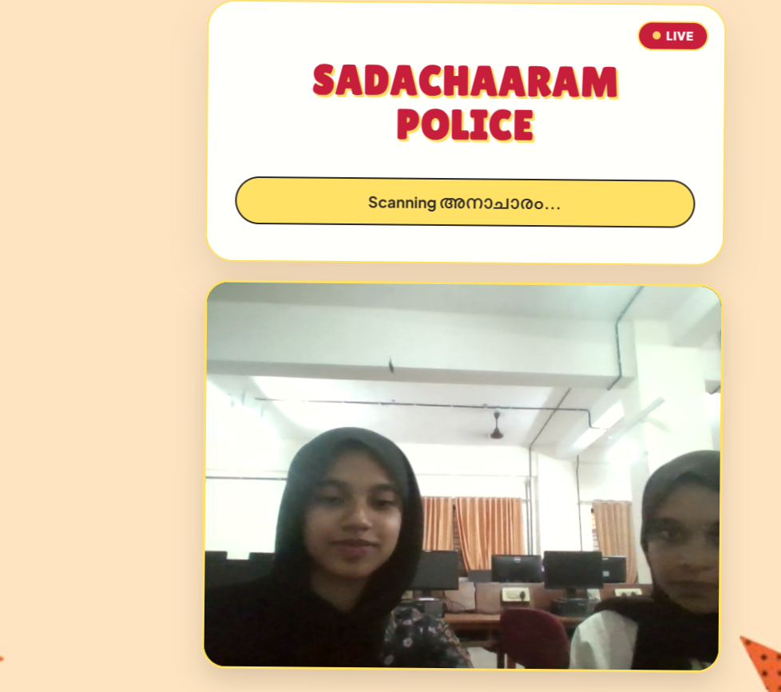
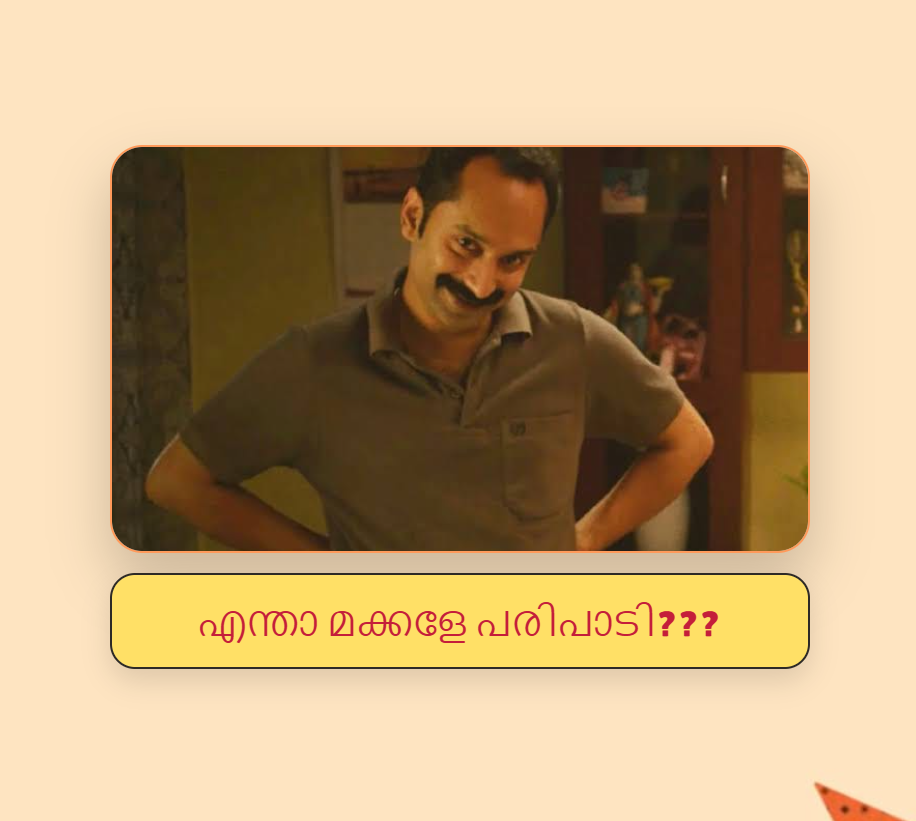
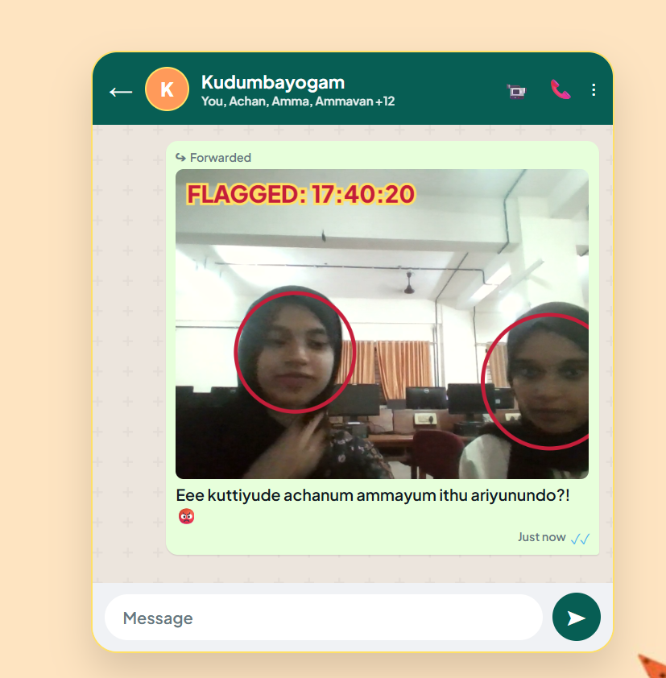
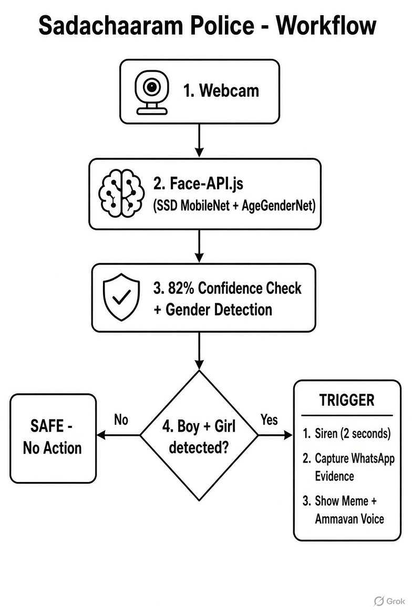

# [] 🎯


## Basic Details
### Team Name: [hackabees]


### Team Members
- Team Lead: [liya ferasha] - [soe,cusat]
- Member 2: [naja parveen] - [soe,cusat]

### Project Description
[It's a satirical,browser-based surveillance app that mocks "moral policing" (sadachaaram) by using AI to detect if a boy and a girl are in the same frame.]

### The Problem (that doesn't exist)
[Traditional values are under attack! Unmarried boys and girls are hanging out together and standing dangerously close to each other in the same webcam frames. This alarming trend is causing severe, unmanageable distress to neighborhood uncles, aunties, and the moral fabric of society.]

### The Solution (that nobody asked for)
[We built the Ammavan Bureau of Investigation (ABI) AI dashboard. It acts as an automated, digital moral police. Using real-time facial recognition, it actively scans webcam feeds. The absolute millisecond it detects a boy and a girl in the same frame, it triggers flashing police lights, a blaring siren, and automatically captures a freeze-frame to generate a fake, stamped "WhatsApp Forwarded" evidence photo ready to be sent to the family group.]

## Technical Details
### Technologies/Components Used
For Software:
- [HTML5,CSS3,JavaScript]
- [none]
- [face-api.js (specifically the SsdMobilenetv1 model for robust face and gender detection)]
- [VS Code, Git/GitHub, Web Audio API (for the generated siren), Web Speech API (for the Text-to-Speech yelling), HTML5 Canvas]

For Hardware:
- [A standard laptop/desktop webcam and speakers.]
- [Any basic web camera and functional audio output for the alarms.]
- [Any modern web browser (Chrome, Edge, Safari)]

### Implementation
For Software:
# Installation
[```bash
# Clone the repository
git clone [https://github.com/liyaferasha/sadhacharapolice.git](https://github.com/liyaferasha/sadhacharapolice.git)

# No npm installations required! Just ensure the following assets are in the same folder as index.html:
# 1. stars.jpeg (Background)
# 2. shammi.jpeg (Meme popup)
# 3. uncle.mp3 (Audio alert)]

# Run
[# Because modern browsers block webcam access for local files, use a local server:
1. Open the project folder in VS Code.
2. Install the "Live Server" extension.
3. Right-click index.html and select "Open with Live Server".
4. Allow camera permissions when prompted by the browser.
5.]

### Project Documentation
For Software:

# Screenshots (Add at least 3)

The Sadachaaram Police Dashboard initializing and scanning the grid for moral violations.


The trap triggered: The app flashes the Shammi meme alert.


The generated WhatsApp forwarded evidence

# Diagrams

Architecture Workflow: The webcam feed is processed locally via `face-api.js`. Detections undergo an 82% strict confidence check. If the 'Ammavan Logic' (Male >= 1 && Female >= 1) is satisfied, it sequentially triggers the CSS alarms, the Web Audio siren, and renders the HTML5 Canvas WhatsApp evidence.

For Hardware:

# Schematic & Circuit

*Not Applicable.* 
*The K.G.B. Threat Dashboard is a purely software-based edge AI application. It relies entirely on client-side web technologies and requires absolutely no custom hardware circuits or microcontrollers.*


# Build Photos

*Not Applicable.*
*100% Software Monolith deployed via the Web*

### Project Demo
# Video
[https://drive.google.com/file/d/1ck3mw3cQUWI71eRejr2B5QbKQiZN565g/view?usp=drivesdk]
*Sadhachaaram Police is a satirical web application that parodies the way people’s personal lives and relationships are often monitored and judged in the name of sadhachaaram (social morality).

The application uses the device camera to detect multiple people and identify when people perceived by the system as being of different genders appear together. When such a situation is detected, the application humorously treats it as a “suspicious activity” and generates an evidence record by capturing a photograph of the scene.

The captured image is presented as if it were an official piece of evidence collected by the fictional Sadhachaaram Police Department. The user can then share the evidence to a family group, parodying the familiar situation where an ammavan, relative, neighbour, or self-appointed moral authority immediately reports someone’s innocent interaction to their family.

The project intentionally exaggerates this behaviour to show how ordinary interactions can be unnecessarily scrutinized, judged, and reported by society. What may simply be two people standing together becomes a completely ridiculous “case” requiring investigation and family notification.*

# Additional Demos
[Add any extra demo materials/links]

## Team Contributions
- [Liya Ferasha]: [Frontend]
- [Naja Parveen ]: [Idea and UI]

---
Made with ❤️ at TinkerHub Useless Projects 


